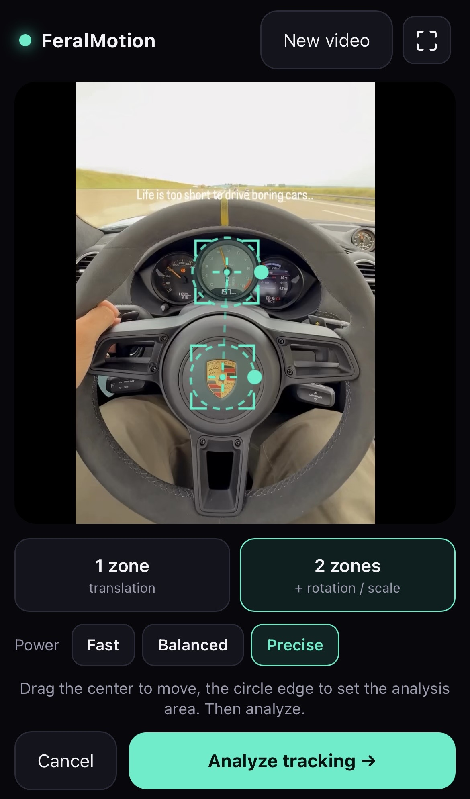
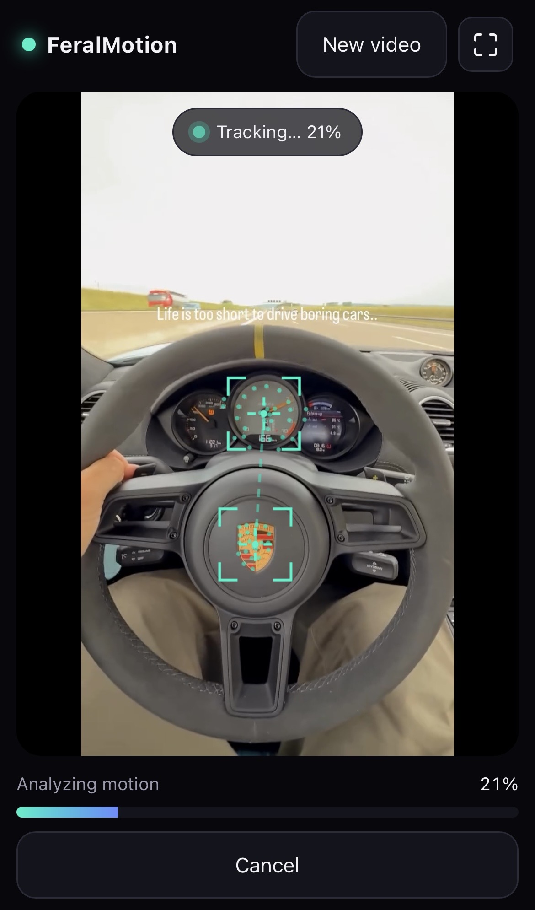
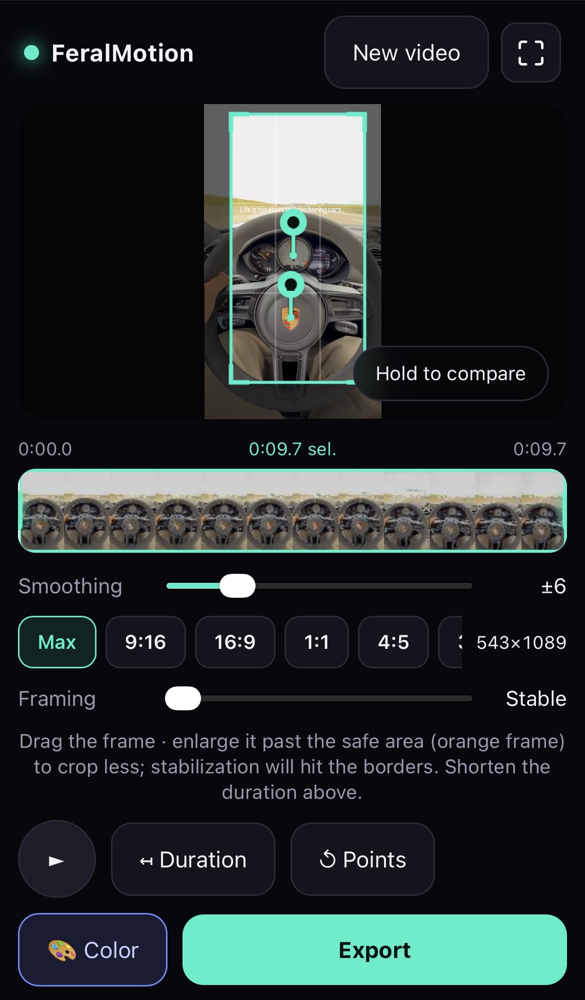
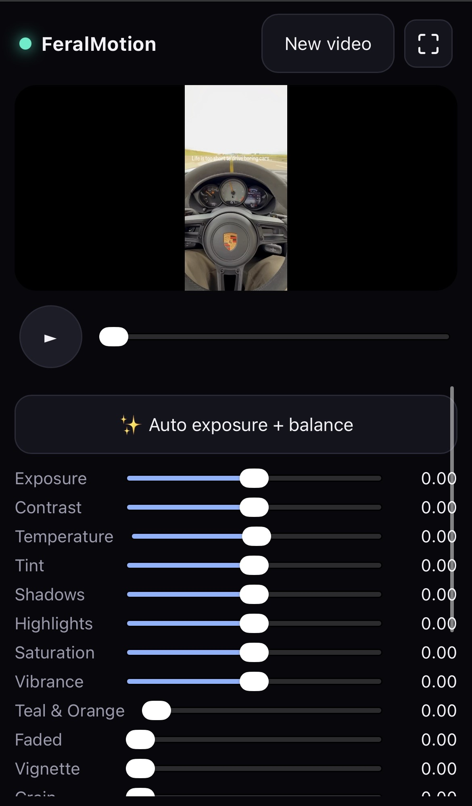

# FeralMotion

**Stabilize and color-grade your videos right in the browser — no upload, no app, nothing leaves your phone.**

FeralMotion is a mobile-first web app that locks down shaky footage by tracking
**1 or 2 points**, then lets you give it a cinematic look with a real-time color
grading suite. Import a clip, tap the parts you want pinned, watch the motion get
analyzed live, frame your shot, grade it, and export a clean high-quality MP4 —
perfect for a rock-steady, good-looking story. Works with touch on iPhone /
Android and with mouse/keyboard on desktop.

---

## See it in action

| | |
|:---:|:---:|
|  |  |
| **1 — Pick 1 or 2 tracking points.** Tap the spots to lock, pinch to zoom, size each analysis zone, choose tracking power. | **2 — Live motion analysis.** The optical-flow tracker follows your points frame by frame, with a visible progress overlay. |
|  |  |
| **3 — Frame your shot.** Pick an aspect ratio, set smoothing, slide between max-stable and full-frame, trim the clip — then hold to compare with the original. | **4 — Cinematic color grading.** Exposure, white balance, tone mapping, teal & orange, film grain, vignette… or one-tap auto + looks. |

---

## Features

### Stabilization
- **Point/zone tracking** — pin **1 point** (pure translation: the point stays
  fixed, the camera's orientation is preserved) or **2 points** (similarity
  transform: both points stay fixed, so camera **rotation and slight zoom are
  compensated** too).
- **Adjustable analysis zones** — each tracked point samples a *cloud* of
  features inside a circle you can resize for precision.
- **Tracking power presets** — Fast / Balanced / Precise, trading speed for
  steadiness (more feature points, bigger search windows).
- **Smoothing** — Gaussian temporal smoothing from locked-down to gentle, recomputed
  instantly without re-running the tracker.
- **Smart framing** — the app computes the *safe area* (the frame minus the
  motion extent) so no black edges ever appear. Slide from **max-stable** toward
  **full-frame**: past the safe area the frame turns orange and the stabilization
  "hits the borders" instead of revealing black. With 2-point rotation the crop
  is kept inside the (tilted) video automatically, so it never overflows.
- **Aspect ratios** — Max, 9:16, 16:9, 1:1, 4:5, 3:4.
- **Trim** — touch-friendly timeline with thumbnails; shorten the clip and the
  usable frame is recomputed for the new range.
- **Hold-to-compare** — press to peek at the original, release to see it stabilized.

### Color grading (CinéGrade)
A real WebGL2 linear-light pipeline — the same shader drives the live preview and
the export, so what you see is what you get:
- **Tone** — exposure, contrast, shadows, highlights.
- **White balance** — temperature & tint.
- **Color** — saturation, vibrance, and a luma-aware **teal & orange** split-tone.
- **Film** — tone-mapping (None / Soft / Filmic / Film), faded blacks, grain,
  vignette, and a cinematic letterbox.
- **One-tap helpers** — ✨ Auto exposure + white balance, plus ready-made **looks**
  (Neutral, Warm cinema, Teal & Orange, Film, Faded, Noir).
- Grading applies **on top of** the stabilized + cropped frame, and shows in
  **every** preview, not just the export.

### Export
- **High quality H.264** via WebCodecs — High profile, near-source bitrate
  (~0.3 bit/pixel·frame, 12 Mbit/s floor, 80 Mbit/s cap), source resolution kept.
- **Fluid motion** — fps is detected and snapped to the exact source rate,
  keeping fractional NTSC rates (23.976 / 29.97 / 59.94) so frames never
  duplicate or drift and audio stays in sync.
- **Audio preserved** — the original AAC track is copied verbatim (works even on
  iOS), with re-encode / MediaRecorder fallbacks.
- **100% client-side** — your footage is decoded, processed and encoded in the
  browser. Nothing is uploaded.

---

## Run

```bash
npm install
npm run dev      # http://localhost:5173
npm run build    # production build
```

---

## How it works

| Step | File | Detail |
|------|------|--------|
| Video load + fps | `src/engine/videoFrames.ts` | probes dimensions/duration, detects fps via `requestVideoFrameCallback` and snaps to the standard rate |
| Point tracking | `src/engine/tracker.ts` | **OpenCV.js** pyramidal Lucas-Kanade optical flow + forward-backward check |
| Analysis pass | `src/engine/analysis.ts` | frame-by-frame seek, tracks the feature clouds, Gaussian temporal smoothing |
| Stabilization math | `src/engine/stabilizer.ts` | 1 point → translation · 2 points → similarity (translation + rotation + scale); `constrainToCrop` keeps the frame inside the video |
| Crop / safe area | `src/engine/crop.ts` | computes the always-covered rect and fits the chosen aspect / framing |
| Color pipeline | `src/color/*` | WebGL2 linear-light grading shader, shared `makeComposite` used by preview **and** export |
| Compositing | `src/color/composite.ts` | video → stabilize + crop (2D canvas) → color grade (WebGL) → output |
| Export | `src/engine/exporter.ts` | **WebCodecs** H.264 + AAC (mp4-muxer / mp4box), automatic **MediaRecorder** fallback |
| UI | `src/App.tsx`, `src/ui/*` | state machine, zoom/pan viewer (Pointer Events), touch trim timeline, color editor |

### About "lossless" export
True lossless is impossible when re-encoding in the browser. FeralMotion instead
targets near-source quality: WebCodecs encodes H.264 at a very high bitrate,
source resolution is preserved, motion is sampled on the exact source frame grid,
and audio is re-injected from the original file. If WebCodecs is unavailable it
falls back to MediaRecorder automatically.

### OpenCV.js
Served **locally** from `public/opencv.js` (self-contained UMD build, base64 wasm,
~10 MB — from npm `@techstark/opencv-js`). No CDN dependency at runtime. It's
lazy-loaded on the first analysis, with a progress bar (`src/engine/opencv.ts`).

---

## Known limitations (it's a prototype)
- OpenCV.js (~10 MB) loads on the first analysis — a short one-time delay.
- Analysis and export advance via `seek`: accurate and format-independent, but
  ~10–30 s for a clip of a few seconds.
- HEVC decoding depends on hardware/browser support; H.264 is the safest source.
- No automatic re-tracking yet after a long occlusion of a point.

---

## License

© 2026 Tom Pascard — https://github.com/pascard/FeralMotion

FeralMotion is distributed under the **PolyForm Noncommercial License 1.0.0**
(see [LICENSE](./LICENSE)).

- ✅ **Noncommercial use allowed** (personal, study, research, education,
  nonprofits…), including modification and redistribution.
- ✅ **Credit required** — you must keep the copyright notice and the
  `Required Notice` line pointing to this GitHub repository.
- ❌ **Commercial use is not permitted** without a separate license — contact the author.

The third-party components (React, mp4-muxer, mp4box.js, OpenCV) remain under
their own permissive licenses; see [THIRD-PARTY-NOTICES.md](./THIRD-PARTY-NOTICES.md).
